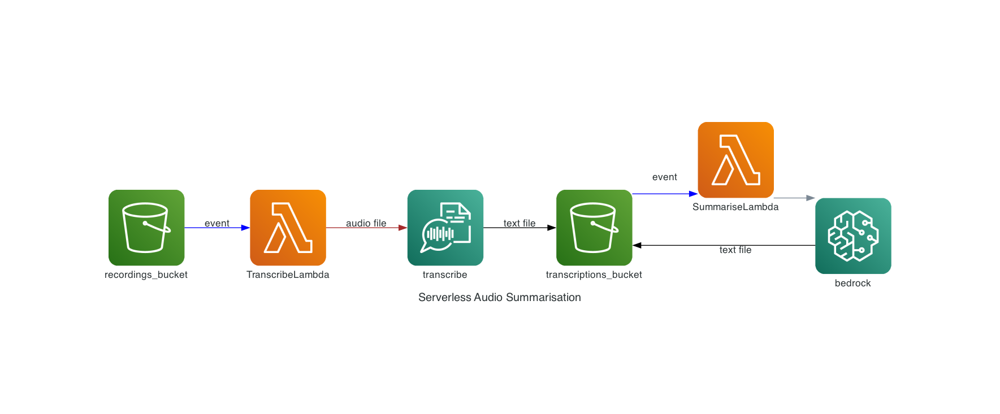

# Architecture



This is a serverless audio summarisation solution using AWS Transcribe and AWS Bedrock. The code is based on [the course](https://www.deeplearning.ai/short-courses/serverless-llm-apps-amazon-bedrock/) by Mike Chambers.

Following stack includes:
- S3 bucket for audio files
- S3 bucket for summarised text
- Lambda function to transcribe audio files
- Lambda function to summarise transcribed text
- Lambda layer for summarisation function
- IAM roles and policies for Lambda functions

You most likely have come from [this article](https://klichx.dev/2024/02/18/serverless-llm-on-aws/) by yours truly.

# Prerequisites:

- Python 3.11 or later
- Node.js LTS, [install](https://nodejs.org/en/download)
- AWS CLI, [install](https://docs.aws.amazon.com/cli/latest/userguide/getting-started-install.html)
- AWS CDK, [install](https://docs.aws.amazon.com/cdk/v2/guide/getting_started.html#getting_started_install)
- Docker, [install](https://docs.docker.com/engine/install/)
- Access to model `amazon.titan-text-express-v1`. Before use [request access](  
https://docs.aws.amazon.com/bedrock/latest/userguide/model-access.html#add-model-access).

Make sure you are logged in to AWS CLI. [How to](https://docs.aws.amazon.com/cdk/v2/guide/getting_started.html#getting_started_auth)

# Deployment

1. Clone the repository `git clone https://github.com/inirudebwoy/serverless-transcribe-summarise-aws-bedrock.git`
2. Create python virtual environment `python -m venv .venv`
3. Activate virtual environment `source .venv/bin/activate`. On Windows, use `.\.venv\Scripts\Activate.ps1`
4. Install dependencies, `pip install -r requirements.txt`
5. Deploy the stack `cdk deploy`
6. After deployment is complete, you will see all resources created in your AWS account

# Verification

Since you have AWS Cli you may as well use it to verify resources created. 

```bash 
# Check for S3 buckets
aws s3 ls | grep cdkllm

# Check for Lambda functions
aws lambda list-functions --query 'Functions[].FunctionName' --no-cli-pager | grep -i cdkllm

# Check for Lambda layer
aws lambda list-layers --query 'Layers[].LayerName' --no-cli-pager | grep -i llm
```

You can also test the stack by uploading an audio file to the S3 bucket created and check the output in the S3 bucket.

```bash
# Upload audio file to S3
aws s3 cp <path_to_audio_file> s3://<bucket_name>

# Check the output in the S3 bucket
aws s3 ls s3://<bucket_name>/summaries/
# Download the output
aws s3 cp s3://<bucket_name>/summaries/ .
```